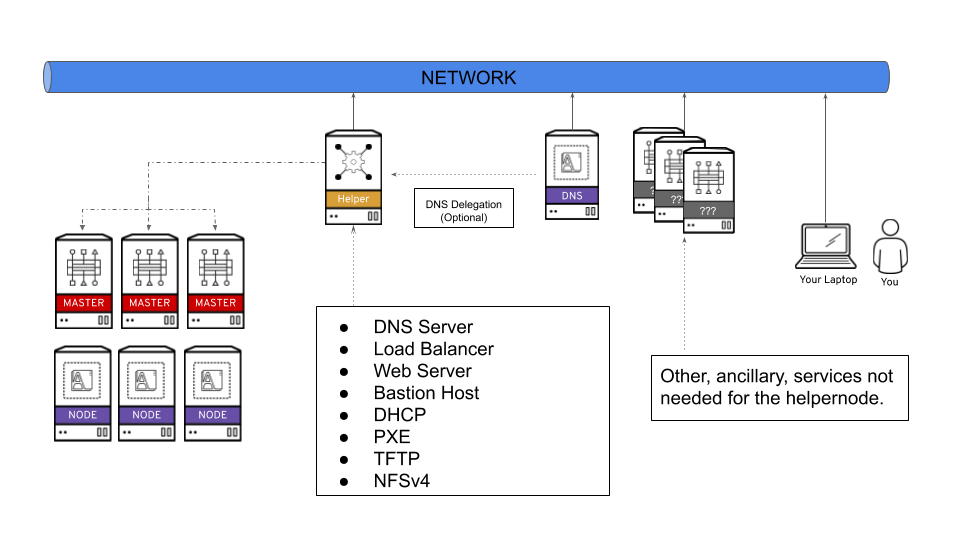

# OCP4 Helper Node

> :heavy_exclamation_mark: *Red Hat support cannot assist with problems with this Repo*. For issues please open a GitHub issue

This playbook helps set up an "all-in-one" node, that has all the infrastructure/services in order to install OpenShift 4. After you run the playbook, you'll be ready to begin the installation process.

A lot of OpenShift 4 specifc jargon is used throughout this doc, so please visit the [official documentation page](https://docs.openshift.com/container-platform/latest) to get familiar with OpenShift 4.

> :warning: This playbook originally was written with BareMetal UPI install in mind

This playbook assumes the following:

1. You're on a Network that has access to the internet.
2. The network you're on does NOT have DHCP (you can disable installing DHCP on the helper).
3. The ocp4-helpernode will be your LB/DHCP/PXE/DNS and HTTP server.
4. You still have to do the OpenShift Install steps by hand.
5. I used CentOS 7/8, but RHEL 7/8 will work as well.
6. You will be running the `openshift-install` command from the ocp4-helpernode.

Below is a highlevel diagram how the ocp4-helpernode fits into your network.




It's important to note that you can delegate DNS to this ocp4-helpernode if you don't want to use it as your main DNS server. You will have to delegate `$CLUSTERID.$DOMAIN` to this helper node.

For example; if you want a `$CLUSTERID` of **ocp4**, and you have a `$DOMAIN` of **example.com**. Then you will delegate `ocp4.example.com` to this ocp4-helpernode.

# Using this playbook

The following are highlevel steps on how to use this playbook. There are more detailed instructions in the ["quickstarts"](#quickstarts) section.

## Prereqs

> :warning: **NOTE** If using RHEL 7, you will need to enable the `rhel-7-server-rpms` and the `rhel-7-server-extras-rpms` repos. If you're using RHEL 8, you will need to enable `rhel-8-for-x86_64-baseos-rpms`, `rhel-8-for-x86_64-appstream-rpms`, and `ansible-2.9-for-rhel-8-x86_64-rpms`.


Install a CentOS 7 or CentOS 8 server with this recommended setup:

* 4 vCPUs
* 4 GB of RAM
* 30GB HD
* Static IP

There is a sample kickstart file for [EL 7](docs/examples/helper-ks.cfg) and [EL 8](docs/examples/helper-ks8.cfg) that is used during testing, if you'd like to automate the initial install of the OS.

Once the base OS is installed, install [EPEL](https://fedoraproject.org/wiki/EPEL)

```
yum -y install https://dl.fedoraproject.org/pub/epel/epel-release-latest-$(rpm -E %rhel).noarch.rpm
```

Next install `ansible` and `git`, then clone this repo.

```
yum -y install ansible git
git clone https://github.com/RedHatOfficial/ocp4-helpernode
cd ocp4-helpernode
```

## Setup your Environment Vars

Inside that dir there is a [vars.yaml](docs/examples/vars.yaml) file under `docs/examples/var.yaml` ... **__modify it__** to match your network and the environment. (the example one assumes a `/24`)

```
cp docs/examples/vars.yaml .
```

> :warning: **NOTE**, currently this playbook assumes/is limited to a `/24` network

See the `vars.yaml` [documentation page](docs/vars-doc.md) for more info about what you can define. There are different options, depending on what you're doing. For example, if you're doing a static ip install vs a dhcp install.


## Run the playbook

Once you edited your `vars.yaml` file; run the playbook

```
ansible-playbook -e @vars.yaml tasks/main.yml
```

## Helper Script

You can run this script and it's options to display helpful information about the install and other post-install goodies.

```
/usr/local/bin/helpernodecheck
```

## Install OpenShift 4 UPI

Now you're ready to follow the [OCP4 UPI install doc](https://docs.openshift.com/container-platform/latest/installing/installing_bare_metal/installing-bare-metal.html#ssh-agent-using_installing-bare-metal)


# Quickstarts

The following are quickstarts. These are written using libvirt, but are generic enough to be used in BareMetal or other Virtualized Environments.


* Bare Metal DHCP install [quickstart](docs/bmquickstart.md)
* Bare Metal Static IPs install [quickstart](docs/bmquickstart-static.md)
* Libvirt DHCP install [quickstart](docs/quickstart.md)
* Libvirt Static IPs install [quickstart](docs/quickstart-static.md)
* DHCP install on KVM/Power [quickstart](docs/quickstart-ppc64le.md)
* DHCP install on PowerVM [quickstart](docs/quickstart-powervm.md)
* OCP4 on VMware vSphere UPI Automation [quickstart](https://github.com/RedHatOfficial/ocp4-vsphere-upi-automation)
* A Video "how-to" done on a [Twitch Stream](docs/yt-twitch.md)

# Contributing

Please see the [contributing doc](docs/contribute.md) for more details.
