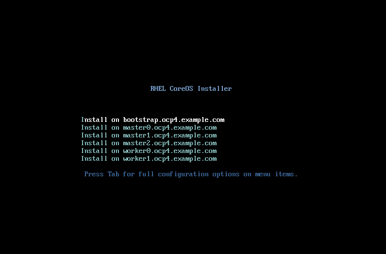

# RHCOS ISO Maker

You can create a custom ISO using [Chuckers' ISO Maker repo](https://github.com/chuckersjp/coreos-iso-maker). This playbook will create a single ISO that has a menu entry for each component (bootstrap/masters/workers).

Although very useful, with my opinionated playbook and his opinionated playbook; it makes it difficult to incorporate it within my playbook. Therefore, I've created this little "how to use the ISO maker with the helpernode".

## Cloning The Repo

I assume you've done all the steps up to (and including) [creating the ignition files](https://github.com/RedHatOfficial/ocp4-helpernode/blob/master/docs/quickstart-static.md#create-ignition-configs). After the ignition files have been created and copied over to your webserver, clone the ISO maker repo.

```
cd ~
git clone https://github.com/chuckersjp/coreos-iso-maker
cd coreos-iso-maker
```

## Configuring ISO Maker

Onced cloned, you'll need to modify the `group_vars/all.yml` file to match your environment.

```yaml
---
gateway: 192.168.7.1
netmask: 255.255.255.0
# VMWare default ens192
# KVM default ens3
# Libvirt default enp1s0
interface: ens3
dns: 
  - 192.168.7.77
  - 192.168.7.1
webserver_url: 192.168.7.77
webserver_port: 8080

# Drive to install RHCOS
# Libvirt - can be vda
install_drive: vda

ocp_version: 4.4
iso_checksum: dc1287165ff5b9d10e729c5541b616d466a9f0ed2e3380d59490503758a4cb24
iso_name: rhcos-{{ ocp_version }}.3-x86_64-installer.x86_64.iso
rhcos_bios: bios.raw.gz
...
```

Few things to note; I had to add the `.3` in the `iso_name` as well as the extra `x86_64`. This var (`iso_name`) is the name of the ISO at the [OpenShift Mirror](https://mirror.openshift.com/pub/openshift-v4/dependencies/rhcos/).

The `iso_checksum` is another thing you need to change that can also be found on the [OpenShift Mirror](https://mirror.openshift.com/pub/openshift-v4/dependencies/rhcos/) in the `sha256sum.txt` file.

Take note that `rhcos_bios` is the name of your bios file on the helpernode.

You also need to edit the `inventory.yml` file based on your environment.

```
---
all:
  children:
    bootstrap:
      hosts:
        bootstrap.ocp4.example.com:
          ipv4: 192.168.7.20
    
    masters:
      hosts:
        master0.ocp4.example.com:
          ipv4: 192.168.7.21

        master1.ocp4.example.com:
          ipv4: 192.168.7.22

        master2.ocp4.example.com:
          ipv4: 192.168.7.23
        
    workers:
      hosts:
        worker0.ocp4.example.com:
          ipv4: 192.168.7.11

        worker1.ocp4.example.com:
          ipv4: 192.168.7.12
...
```

## ISO Maker Hacking Required

In the `playbook-single.yml` I had to modify the `get_url` task to the right `url`. I needed to add a `.3` in order to download the right URL. Here is a diff of the file...

```
diff --git a/playbook-single.yml b/playbook-single.yml
index eb8e52a..679a6cc 100644
--- a/playbook-single.yml
+++ b/playbook-single.yml
@@ -16,7 +16,7 @@
   - block:
     - name: Get the original ISO
       get_url:
-        url: https://mirror.openshift.com/pub/openshift-v4/dependencies/rhcos/{{ ocp_version }}/{{ ocp_version }}.0/{{ iso_name }}
+        url: https://mirror.openshift.com/pub/openshift-v4/dependencies/rhcos/{{ ocp_version }}/{{ ocp_version }}.3/{{ iso_name }}
         dest: /tmp
         checksum: sha256:{{ iso_checksum }}
```

I basically changed `https://mirror.openshift.com/pub/openshift-v4/dependencies/rhcos/{{ ocp_version }}/{{ ocp_version }}.0/{{ iso_name }}` to `https://mirror.openshift.com/pub/openshift-v4/dependencies/rhcos/{{ ocp_version }}/{{ ocp_version }}.3/{{ iso_name }}`

## HelperNode Hacking Required

You'll need to move some stuff around where the ISO maker expects them to find them.

```
cp /var/www/html/install/bios.raw.gz /var/www/html/
cp /var/www/html/ignition/*.ign /var/www/html/
ln -s /var/www/html/worker.ign /var/www/html/workers.ign
ln -s /var/www/html/master.ign /var/www/html/masters.ign
chmod o+r /var/www/html/*
restorecon -vR /var/www/html
```

## Run The Playbook

Now run the playbook.

```
ansible-playbook playbook-single.yml
```

The playbook will create the ISO file `/tmp/rhcos_install-cluster.iso`. You can use this to boot all your nodes.

## Booting Into ISO

When you boot into this ISO, you'll be greeted with the following menu.



Choose the correct option for the server you're installing. I would boot them in the following order: bootstrap, masters, and then workers.

## Success

Once you've booted into the right option, RHCOS will install with the right IP address.

You're now ready to continue with [the next step](https://github.com/RedHatOfficial/ocp4-helpernode/blob/master/docs/quickstart-static.md#wait-for-install) of the install.
