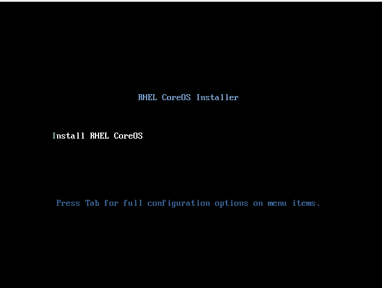

# Helper Node Quickstart Install - Static IPs

This quickstart will get you up and running on `libvirt`. This should work on other environments (i.e. Virtualbox or Enterprise networks); you just have to substitue where applicable

To start login to your virtualization server / hypervisor

```
ssh virt0.example.com
```

And create a working directory

```
mkdir ~/ocp4-workingdir
cd ~/ocp4-workingdir
```

## Create Virtual Network

Download the virtual network configuration file, [virt-net.xml](examples/virt-net.xml)

```
wget https://raw.githubusercontent.com/RedHatOfficial/ocp4-helpernode/master/docs/examples/virt-net.xml
```

Create a virtual network using this file file provided in this repo (modify if you need to).


```
virsh net-define --file virt-net.xml
```

Make sure you set it to autostart on boot

```
virsh net-autostart openshift4
virsh net-start openshift4
```

## Create a CentOS 7/8 VM

Download the Kickstart file for either [EL 7](examples/helper-ks.cfg) or [EL 8](examples/helper-ks8.cfg) for the helper node.

__EL 7__
```
wget https://raw.githubusercontent.com/RedHatOfficial/ocp4-helpernode/master/docs/examples/helper-ks.cfg -O helper-ks.cfg
```

__EL 8__
```
wget https://raw.githubusercontent.com/RedHatOfficial/ocp4-helpernode/master/docs/examples/helper-ks8.cfg -O helper-ks.cfg
```

Edit `helper-ks.cfg` for your environment and use it to install the helper. The following command installs it "unattended".

> **NOTE** Change the path to the ISO for your environment

__EL 7__
```
virt-install --name="ocp4-aHelper" --vcpus=2 --ram=4096 \
--disk path=/var/lib/libvirt/images/ocp4-aHelper.qcow2,bus=virtio,size=30 \
--os-variant centos7.0 --network network=openshift4,model=virtio \
--boot hd,menu=on --location /var/lib/libvirt/ISO/CentOS-7-x86_64-Minimal-1810.iso \
--initrd-inject helper-ks.cfg --extra-args "inst.ks=file:/helper-ks.cfg" --noautoconsole
```

__EL 8__
```
virt-install --name="ocp4-aHelper" --vcpus=2 --ram=4096 \
--disk path=/var/lib/libvirt/images/ocp4-aHelper.qcow2,bus=virtio,size=50 \
--os-variant centos8 --network network=openshift4,model=virtio \
--boot hd,menu=on --location /var/lib/libvirt/ISO/CentOS-8-x86_64-1905-dvd1.iso \
--initrd-inject helper-ks.cfg --extra-args "inst.ks=file:/helper-ks.cfg" --noautoconsole
```

The provided Kickstart file installs the helper with the following settings (which is based on the [virt-net.xml](examples/virt-net.xml) file that was used before).

* IP - 192.168.7.77
* NetMask - 255.255.255.0
* Default Gateway - 192.168.7.1
* DNS Server - 8.8.8.8

> **NOTE** If you want to use macvtap (i.e. have the VM "be on your network"); you can use `--network type=direct,source=enp0s31f6,source_mode=bridge,model=virtio` ; replace the interface where applicable

You can watch the progress by lauching the viewer

```
virt-viewer --domain-name ocp4-aHelper
```

Once it's done, it'll shut off...turn it on with the following command

```
virsh start ocp4-aHelper
```

## Prepare the Helper Node

After the helper node is installed; login to it

```
ssh root@192.168.7.77
```

> **NOTE** If using RHEL 7 - you need to enable the `rhel-7-server-rpms` and the `rhel-7-server-extras-rpms` repos. If you're using RHEL 8 you will need to enable `rhel-8-for-x86_64-baseos-rpms`, `rhel-8-for-x86_64-appstream-rpms`, and `ansible-2.9-for-rhel-8-x86_64-rpms`

Install EPEL

```
yum -y install https://dl.fedoraproject.org/pub/epel/epel-release-latest-$(rpm -E %rhel).noarch.rpm
```

Install `ansible` and `git` and clone this repo

```
yum -y install ansible git
git clone https://github.com/RedHatOfficial/ocp4-helpernode
cd ocp4-helpernode
```

Create the [vars-static.yaml](examples/vars-static.yaml) file with the IP addresss that will be assigned to the masters/workers/boostrap. The IP addresses need to be right since they will be used to create your DNS server.

> **NOTE** See the `vars.yaml` [documentaion page](vars-doc.md) for more info about what it does.


## Run the playbook

Run the playbook to setup your helper node (using `-e staticips=true` to flag to ansible that you won't be installing dhcp/tftp)

```
ansible-playbook -e @vars-static.yaml -e staticips=true tasks/main.yml
```

After it is done run the following to get info about your environment and some install help

```
/usr/local/bin/helpernodecheck
```

## Create Ignition Configs

Now you can start the installation process. Create an install dir.

```
mkdir ~/ocp4
cd ~/ocp4
```

Create a place to store your pull-secret

```
mkdir -p ~/.openshift
```

Visit [try.openshift.com](https://cloud.redhat.com/openshift/install) and select "Bare Metal". Download your pull secret and save it under `~/.openshift/pull-secret`

```shell
# ls -1 ~/.openshift/pull-secret
/root/.openshift/pull-secret
```

This playbook creates an sshkey for you; it's under `~/.ssh/helper_rsa`. You can use this key or create/user another one if you wish.

```
# ls -1 ~/.ssh/helper_rsa
/root/.ssh/helper_rsa
```

> :warning: If you want you use your own sshkey, please modify `~/.ssh/config` to reference your key instead of the one deployed by the playbook

Next, create an `install-config.yaml` file.

> :warning: Make sure you update if your filenames or paths are different.

```
cat <<EOF > install-config.yaml
apiVersion: v1
baseDomain: example.com
compute:
- hyperthreading: Enabled
  name: worker
  replicas: 0
controlPlane:
  hyperthreading: Enabled
  name: master
  replicas: 3
metadata:
  name: ocp4
networking:
  clusterNetworks:
  - cidr: 10.254.0.0/16
    hostPrefix: 24
  networkType: OpenShiftSDN
  serviceNetwork:
  - 172.30.0.0/16
platform:
  none: {}
pullSecret: '$(< ~/.openshift/pull-secret)'
sshKey: '$(< ~/.ssh/helper_rsa.pub)'
EOF
```

Create the installation manifests

```
openshift-install create manifests
```

Edit the `manifests/cluster-scheduler-02-config.yml` Kubernetes manifest file to prevent Pods from being scheduled on the control plane machines by setting `mastersSchedulable` to `false`.

> :rotating_light: Skip this step if you're installing a compact cluster

```shell
$ sed -i 's/mastersSchedulable: true/mastersSchedulable: false/g' manifests/cluster-scheduler-02-config.yml
```

It should look something like this after you edit it.

```shell
$ cat manifests/cluster-scheduler-02-config.yml
apiVersion: config.openshift.io/v1
kind: Scheduler
metadata:
  creationTimestamp: null
  name: cluster
spec:
  mastersSchedulable: false
  policy:
    name: ""
status: {}
```

Next, generate the ignition configs

```
openshift-install create ignition-configs
```

Finally, copy the ignition files in the `ignition` directory for the websever

```
cp ~/ocp4/*.ign /var/www/html/ignition/
restorecon -vR /var/www/html/
chmod o+r /var/www/html/ignition/*.ign
```

## Install VMs

> :warning: Read all the instructions before attempting to install RHCOS!

Install each VM one by one; here's an example for my boostrap node

> **NOTE** If you want to use macvtap (i.e. have the VM "be on your network"); you can use `--network type=direct,source=enp0s31f6,source_mode=bridge,model=virtio` ; replace the interface where applicable

```
virt-install --name=ocp4-bootstrap --vcpus=4 --ram=8192 \
--disk path=/var/lib/libvirt/images/ocp4-bootstrap.qcow2,bus=virtio,size=120 \
--os-variant rhel8.0 --network network=openshift4,model=virtio \
--boot menu=on --cdrom /exports/ISO/rhcos-4.2.0-x86_64-installer.iso
```

> **NOTE** If the console doesn't launch you can open it via `virt-manager`

Once booted; press `tab` on the boot menu



Add your staticips and coreos options. Here is an example of what I used for my bootstrap node. (type this **ALL IN ONE LINE** ...I only used linebreaks here for ease of readability...but type it all in one line)

> If installing 4.5 and earlier, you need `coreos.inst.image_url=http://192.168.7.77:8080/install/bios.raw.gz`

```
ip=192.168.7.20::192.168.7.1:255.255.255.0:bootstrap.ocp4.example.com:enp1s0:none
nameserver=192.168.7.77
coreos.inst.install_dev=vda
coreos.live.rootfs_url=http://192.168.7.77:8080/install/rootfs.img
coreos.inst.ignition_url=http://192.168.7.77:8080/ignition/bootstrap.ign
```

^ Do this for **ALL** of your VMs!!!

> **NOTE** Using `ip=...` syntax will set the host with a static IP you provided persistantly accross reboots. The syntax is `ip=<ipaddress>::<defaultgw>:<netmask>:<hostname>:<iface>:none`. To set the DNS server use `nameserver=<dnsserver>`. You can use `nameserver=` multiple times.

Boot/install the VMs in the following order

* Bootstrap
* Masters
* Workers

On your laptop/workstation visit the status page

```
firefox http://192.168.7.77:9000
```

You'll see the bootstrap turn "green" and then the masters turn "green", then the bootstrap turn "red". This is your indication that you can continue.

### ISO Maker

Manually booting into the ISO and typing in the kernel parameters for ALL nodes can be cumbersome. You **MAY** want to opt to use [Chuckers' ISO maker](https://github.com/chuckersjp/coreos-iso-maker). I've written a little [how to](iso-maker.md) for the HelperNode.

## Wait for install

The boostrap VM actually does the install for you; you can track it with the following command.

```
openshift-install wait-for bootstrap-complete --log-level debug
```

Once you see this message below...

```
DEBUG OpenShift Installer v4.2.0-201905212232-dirty
DEBUG Built from commit 71d8978039726046929729ad15302973e3da18ce
INFO Waiting up to 30m0s for the Kubernetes API at https://api.ocp4.example.com:6443...
INFO API v1.13.4+838b4fa up
INFO Waiting up to 30m0s for bootstrapping to complete...
DEBUG Bootstrap status: complete
INFO It is now safe to remove the bootstrap resources
```

...you can continue....at this point you can delete the bootstrap server.

## Finish Install

First, login to your cluster

```
export KUBECONFIG=/root/ocp4/auth/kubeconfig
```

Your install may be waiting for worker nodes to get approved. Normally the `machineconfig node approval operator` takes care of this for you. However, sometimes this needs to be done manually. Check pending CSRs with the following command.

```
oc get csr 
```

You can approve all pending CSRs in "one shot" with the following

```
oc get csr -o go-template='{{range .items}}{{if not .status}}{{.metadata.name}}{{"\n"}}{{end}}{{end}}' | xargs oc adm certificate approve
```

You may have to run this multiple times depending on how many workers you have and in what order they come in. Keep a `watch` on these CSRs

```
watch oc get csr 
```

In order to setup your registry, you first have to set the `managementState` to `Managed` for your cluster

```
oc patch configs.imageregistry.operator.openshift.io cluster --type merge --patch '{"spec":{"managementState":"Managed"}}'
```

For PoCs, using `emptyDir` is okay (to use PVs follow [this](https://docs.openshift.com/container-platform/latest/installing/installing_bare_metal/installing-bare-metal.html#registry-configuring-storage-baremetal_installing-bare-metal) doc)

```
oc patch configs.imageregistry.operator.openshift.io cluster --type merge --patch '{"spec":{"storage":{"emptyDir":{}}}}'
```

If you need to expose the registry, run this command

```
oc patch configs.imageregistry.operator.openshift.io/cluster --type merge -p '{"spec":{"defaultRoute":true}}'
```

To finish the install process, run the following

```
openshift-install wait-for install-complete
```

> Note: You can watch the operators running with `oc get clusteroperators` in another window with a `watch` to see it progress

## Login to the web console

The OpenShift 4 web console will be running at `https://console-openshift-console.apps.{{ dns.clusterid }}.{{ dns.domain }}` (e.g. `https://console-openshift-console.apps.ocp4.example.com`)

* Username: kubeadmin
* Password: the output of `cat /root/ocp4/auth/kubeadmin-password`

## Upgrade

If you didn't install the latest release, then just run the following to upgrade.

```
oc adm upgrade --to-latest
```

If you're having issues upgrading you can try adding `--force` to the upgrade command.

```
oc adm upgrade --to-latest --force
```

See [issue #46](https://github.com/RedHatOfficial/ocp4-helpernode/issues/46) to understand why the `--force` is necessary and an alternative to using it.

Scale the router if you need to

```
oc patch --namespace=openshift-ingress-operator --patch='{"spec": {"replicas": 3}}' --type=merge ingresscontroller/default
```

## DONE

Your install should be done! You're a UPI master!
